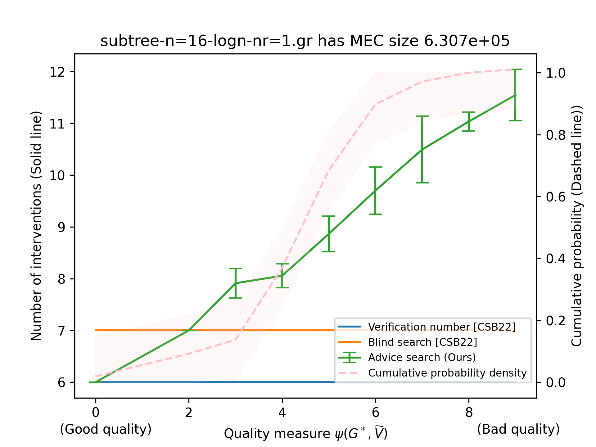
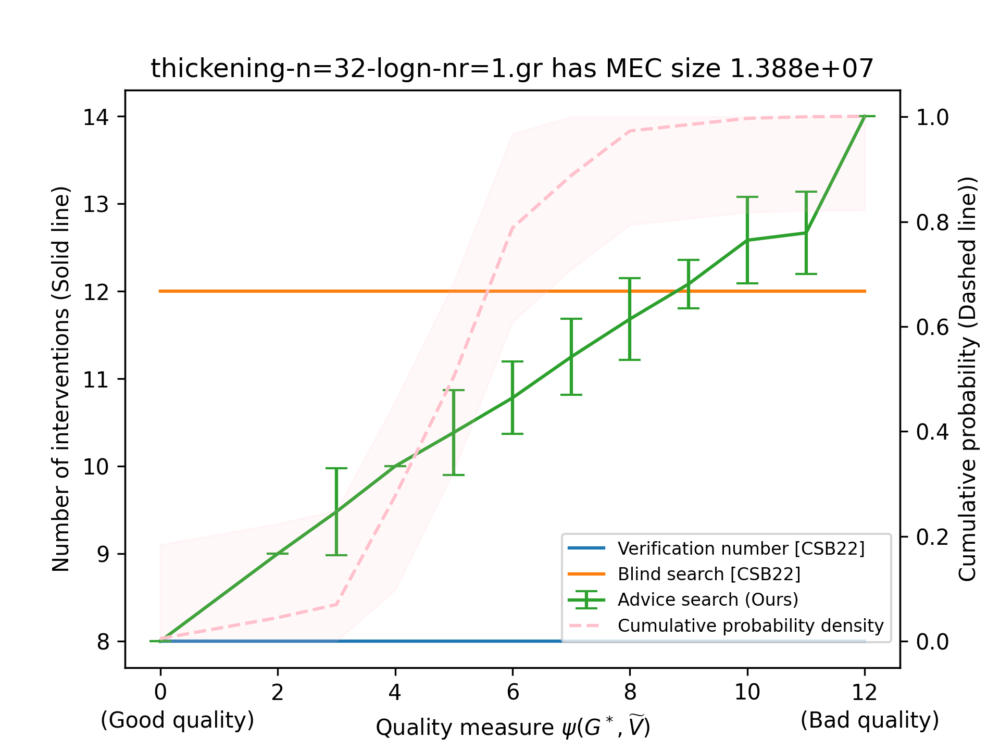

# Active causal structure learning with advice

This is the accompanying repository the "Active causal structure learning with advice" paper. It is available at **coming soon**.

We have included a copy of the produced `figures` sub-directory in here so you may look at the output without running the experiments yourself.

## Experimental details

Motivated by Theorem 7 of [CS23], we experimented on synthetic moral DAGs.

### Synthetic graph classes

We evaluated our advice algorithm on the synthetic graph instances of [WBL21] on graph instances of sizes $n = \{16, 32, 64\}$.
See Appendix E of [WBL21] for details about each class of synthetic graphs. Instances are available at https://github.com/mwien/CliquePicking/tree/master/aaai_experiments.

For each undirected chordal graph instance, we do the following:

1. Set $m = 1000$ as the number of advice DAGs that we will sample.

2. Use the uniform sampling algorithm of [WBL21] to uniformly sample $m$ advice DAGs $\widetilde{G}_1, \ldots, \widetilde{G}_{m}$.

3. Randomly select $G^*$ from one of $\widetilde{G}_1, \ldots, \widetilde{G}_{m}$.

4. For each $\widetilde{G} \in \{\widetilde{G}_1, \ldots, \widetilde{G}_{m}\}$,  
- Compute a minimum verifying set $\widetilde{V}$ of $\widetilde{G}$.
- Define and compute $\psi(G^*, \widetilde{V}) = \left| \rho(\widetilde{V}, N_{skel(\mathcal{E}(G^*))}^{h(G^*, \widetilde{V})}(\widetilde{V}) \right|$.
- Compute a verifying set using $(\mathcal{E}(G^*), \widetilde{G})$ as input to Algorithm 3.

5. Aggregate the sizes of the verifying sets used based on $\psi(G^*, \widetilde{V})$ and compute the mean and standard deviations.

6. Compare against verification number $\nu_1(G^*)$ and the number of interventions used by the fully adaptive search (without advice, which we denote as "blind search" in the plots) of [CSB22].

7. Compute the empirical distribution of the quality measure amongst the $m$ advice DAGs, then use standard sample complexity arguments for estimating distributions up to $\epsilon$ error in TV distance to compute a confidence interval for which the true cumulative probability density of all DAGs within the MEC lies within (e.g., see Theorem 1 of [C20]). To be precise, it is known that for a discrete distribution $P$ on $k$ elements, when there are $m \geq \max\{k/\epsilon^2, (2/\epsilon^2) \cdot \ln (2/\delta)\}$ uniform samples, the probability that the TV distance between the true distribution $P$ and the empirical distribution $P$ is less than $\epsilon$ is at least $1-\delta$. Since the *upper bound* on the domain size of quality measure is the number of nodes $n$, by setting $m=1000$ and $\delta = 0.01$, we can compute $\epsilon = \max\{\sqrt{n/m}, \sqrt{(2/m) \cdot \ln (2/\delta)}\}$ and conclude that the probability that the true cumulative probability density of all DAGs within the MEC lies within $\epsilon$ distance (clipped to be between 0 and 1) of the empirical distribution is at least 99\%.

### Qualitative discussion of experimental results

On the X-axis, we plot $\psi(G^*, \widetilde{V}) = \left| \rho \left( \widetilde{V}, N_{skel(\mathcal{E}(G^*))}^{h(G^*, \widetilde{V})}(\widetilde{V}) \right) \right|$, which is a *lower bound* and proxy for $\psi(G^*, \widetilde{G})$.
Note that we do not know if there is an efficient way to compute $\psi(G^*, \widetilde{G})$ besides the naive (possibly exponential time) enumeration over all possible minimum verifying sets.

On the Y-axis, we aggregate advice DAGs based on their quality measure and also show (in dashed lines) the empirical distribution of quality measures of all DAGs within the Markov equivalence class.
As expected from our theoretical analyses, we see that the number of interventions by our advice search starts from $\nu_1(G^*)$, is lower than advice-free search of [CSB22] when $\psi(G^*, \widetilde{V})$ is low, and gradually increases as the advice quality degrades.
Nonetheless, the number of interventions used is always theoretically bounded below $\mathcal{O}(\psi(G^*, \widetilde{V}) \cdot \nu_1(G^*))$, which we do not plot since plotting it yields a "squashed" graph as the empirical counts are significantly smaller.

Consider the following experimental plot for one of the synthetic graphs $G^*$, with respect to $1000 \ll |[G^*]| \approx 1.4 \times 10^{6}$ uniformly sampled advice DAGs $\widetilde{G}$ from the MEC $[G^*]$. The solid lines indicate the number of atomic interventions used while the dotted lines indicate the empirical cumulative probability density of $\widetilde{G}$. The true cumulative probability density lies within the shaded area with probability at least 0.99. This specific graph instance suggests that our advice search outperforms its advice-free counterpart when given an advice DAG $\widetilde{G}$ that is better than $\sim 40\%$ of all possible DAGs consistent with the observational essential graph $\mathcal{E}(G^*)$.

### Some experimental remarks

- The uniform sampling code of [WBL21] is written in Julia and it uses a non-trivial amount of memory, which may make it unsuitable for running on a shared server with memory constraints.

- Note that $\psi(G^*, \widetilde{V}) \leq \psi(G^*, \widetilde{G}) = \max_{\widetilde{V} \in \mathcal{V}(\widetilde{G})} \left| \rho \left( \widetilde{V}, N^{h(G^*, \widetilde{V})}_{skel(\mathcal{E}(G^*))}(\widetilde{V}) \right) \right|$. We use $\psi(G^*, \widetilde{V})$ as a proxy for $\psi(G^*, \widetilde{G})$ because we do not know if there is an efficient way to compute the latter besides the naive (possibly exponential time) enumeration over all possible minimum verifying sets.

- We also experimented with an "unsafe" variant of Algorithm 3 where we ignore the second tweak of intervening one round before. In our synthetic experiments, both variants use a similar number of interventions.

- We do not plot the theoretical upper bounds $\mathcal{O}(\log \psi(G^*, \widetilde{V}) \cdot \nu_1(G^*))$ or $\mathcal{O}(\log n \cdot \nu_1(G^*))$ because these values are a significantly higher than the other curves and result in "squashed" (and less interesting/interpretable) plots.

- Note that the error bar may appear "lower" than the verification number even though all intervention sizes are at least as large as the verification number. For instance, if $\nu_1(G^*) = 6$ and we used $(6,6,7)$ interventions on three different $\widetilde{G}$'s, each with $\psi(G^*, \widetilde{V}) = 0$. In this case, the mean is $6.3333\ldots$ while the standard deviation is $0.4714\ldots$, so the error bar will display an interval of $[5.86\ldots, 6.80\ldots]$ whose lower interval is below $\nu_1(G^*) = 6$.

- Even when $\psi(G^*, \widetilde{V}) = 0$, there could be cases where [CSB22] uses more interventions than $\nu_1(G^*)$. For example, consider the figure bleow (Figure 8 in our paper) with $G^* = G_2$ and $\widetilde{G} = G_1$. After intervening on $\widetilde{V} = \{b,c\}$, the entire graph will be oriented so the $\psi(G^*, \widetilde{V}) = 0$ while $\nu_1(G^*) = 1 < 2 = |\widetilde{V}|$. Fortunately, Theorem 3.1 in our paper guarantees that $|\widetilde{V}| \leq 2 \cdot \nu_1(G^*)$.

|  |
|:--:|
| The ratio of 2 in Theorem 3.1 in our paper is tight: $G_1$ and $G_2$ belong in the same MEC with $\nu(G_1) = 2$ and $\nu(G_2) = 1$. The dashed arcs represent the covered edges and the boxed vertices represent a minimum vertex cover of the covered edges. |

## All experimental plots

Each experimental plot is for one of the synthetic graphs $G^*$, with respect to $1000 \ll |[G^*]|$ uniformly sampled advice DAGs $\widetilde{G}$ from the MEC $[G^*]$.
The solid lines indicate the number of atomic interventions used while the dotted lines indicate the empirical cumulative probability density of $\widetilde{G}$.
The true cumulative probability density lies within the shaded area with probability at least 0.99.

### Subtree-logn synthetic graphs

### Subtree-2logn synthetic graphs

### Subtree-sqrtn synthetic graphs

### Interval synthetic graphs

### peo-2 synthetic graphs

### peo-4 synthetic graphs

### Thickening-3 synthetic graphs

### Thickening-logn synthetic graphs

### Thickening-sqrtn synthetic graphs

## References

[C20] Clément L. Canonne. A short note on learning discrete distributions. arXiv, 2020. Available at https://arxiv.org/pdf/2002.11457.pdf

[WBL21] Marcel Wienöbst, Max Bannach, and Maciej Liskiewicz. Polynomial-Time Algorithms for Counting and Sampling
Markov Equivalent DAGs with Applications. AAAI, 2021. Available at https://arxiv.org/pdf/2205.02654.pdf

[CSB22] Davin Choo, Kirankumar Shiragur, and Arnab Bhattacharyya. Verification and search algorithms for causal DAGs. Advances in Neural Information Processing Systems, 2022. Available at https://arxiv.org/pdf/2206.15374.pdf

[CS23] Davin Choo and Kirankumar Shiragur. Subset verification and search algorithms for causal DAGs. In International Conference on Artificial Intelligence and Statistics, 2023. Available at https://arxiv.org/pdf/2301.03180.pdf